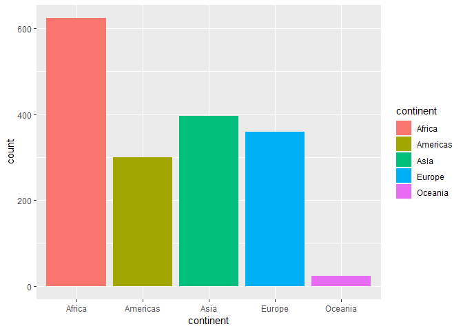
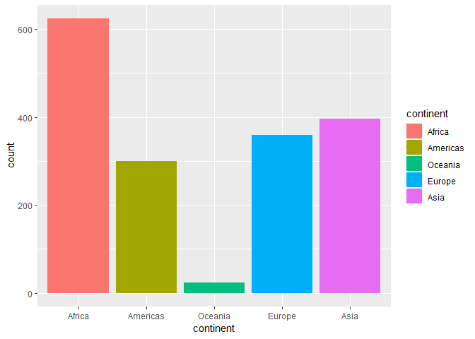
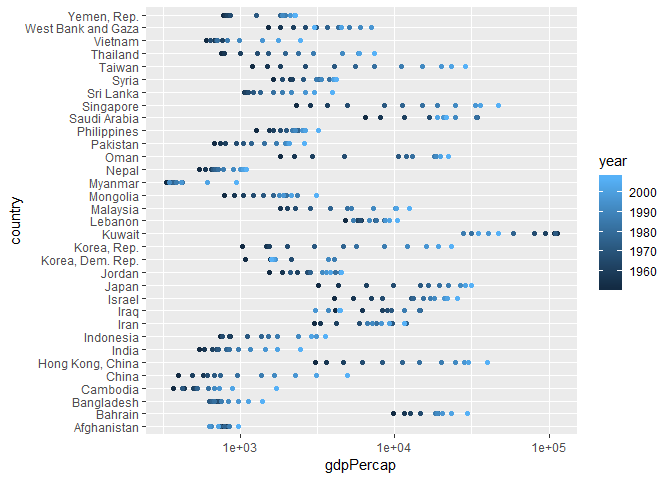
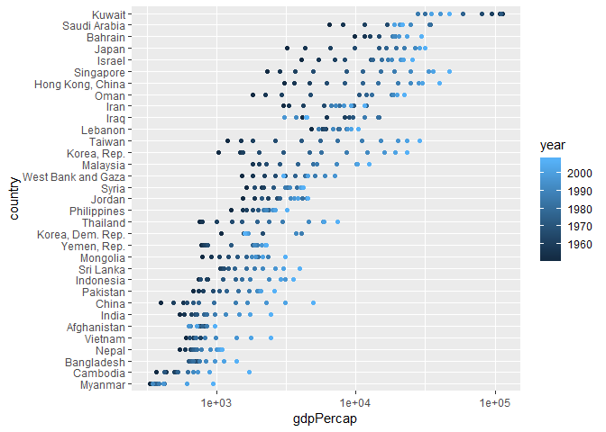
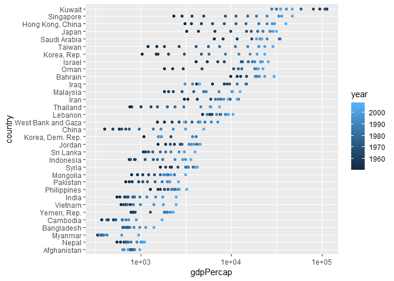
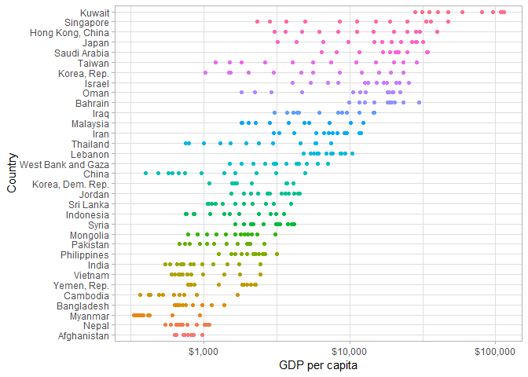
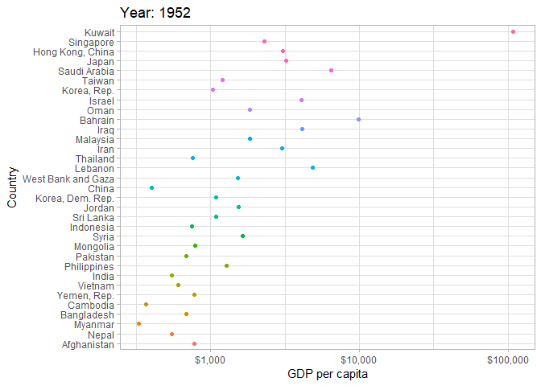

Homework 05 - Factor and figure management
================

## Load packages

``` r
library(gapminder)
library(tidyverse)
library(knitr)
```

## Part 1: Factor Management

I will use the gapminder dataset for this exercise.

### Drop level/factors

The original gapminder data looks like:

``` r
head(gapminder)
```

    ## # A tibble: 6 x 6
    ##   country     continent  year lifeExp      pop gdpPercap
    ##   <fct>       <fct>     <int>   <dbl>    <int>     <dbl>
    ## 1 Afghanistan Asia       1952    28.8  8425333      779.
    ## 2 Afghanistan Asia       1957    30.3  9240934      821.
    ## 3 Afghanistan Asia       1962    32.0 10267083      853.
    ## 4 Afghanistan Asia       1967    34.0 11537966      836.
    ## 5 Afghanistan Asia       1972    36.1 13079460      740.
    ## 6 Afghanistan Asia       1977    38.4 14880372      786.

``` r
str(gapminder)
```

    ## Classes 'tbl_df', 'tbl' and 'data.frame':    1704 obs. of  6 variables:
    ##  $ country  : Factor w/ 142 levels "Afghanistan",..: 1 1 1 1 1 1 1 1 1 1 ...
    ##  $ continent: Factor w/ 5 levels "Africa","Americas",..: 3 3 3 3 3 3 3 3 3 3 ...
    ##  $ year     : int  1952 1957 1962 1967 1972 1977 1982 1987 1992 1997 ...
    ##  $ lifeExp  : num  28.8 30.3 32 34 36.1 ...
    ##  $ pop      : int  8425333 9240934 10267083 11537966 13079460 14880372 12881816 13867957 16317921 22227415 ...
    ##  $ gdpPercap: num  779 821 853 836 740 ...

We see that there are 5 levels of continent.

``` r
levels(gapminder$continent)
```

    ## [1] "Africa"   "Americas" "Asia"     "Europe"   "Oceania"

Let’s see what happens when we remove all observations where the
continent is Oceania. We can remove all occurances of Oceania under
continents using `filter` and observe how this affects the dataframe:

``` r
gapminder_no_ocean = gapminder %>% 
  filter(continent != 'Oceania')

gapminder_no_ocean %>% str()
```

    ## Classes 'tbl_df', 'tbl' and 'data.frame':    1680 obs. of  6 variables:
    ##  $ country  : Factor w/ 142 levels "Afghanistan",..: 1 1 1 1 1 1 1 1 1 1 ...
    ##  $ continent: Factor w/ 5 levels "Africa","Americas",..: 3 3 3 3 3 3 3 3 3 3 ...
    ##  $ year     : int  1952 1957 1962 1967 1972 1977 1982 1987 1992 1997 ...
    ##  $ lifeExp  : num  28.8 30.3 32 34 36.1 ...
    ##  $ pop      : int  8425333 9240934 10267083 11537966 13079460 14880372 12881816 13867957 16317921 22227415 ...
    ##  $ gdpPercap: num  779 821 853 836 740 ...

``` r
levels(gapminder_no_ocean$continent)
```

    ## [1] "Africa"   "Americas" "Asia"     "Europe"   "Oceania"

We see that despite there are now fewer observations in the dataframe,
however the factor levels of continent is still 5. Despite removing the
occurances of Oceania, it is still a level in the factor. We can remove
this level altogether with `droplevels()`

``` r
gapminder_no_ocean = gapminder_no_ocean %>% 
  droplevels()

gapminder_no_ocean %>% str()
```

    ## Classes 'tbl_df', 'tbl' and 'data.frame':    1680 obs. of  6 variables:
    ##  $ country  : Factor w/ 140 levels "Afghanistan",..: 1 1 1 1 1 1 1 1 1 1 ...
    ##  $ continent: Factor w/ 4 levels "Africa","Americas",..: 3 3 3 3 3 3 3 3 3 3 ...
    ##  $ year     : int  1952 1957 1962 1967 1972 1977 1982 1987 1992 1997 ...
    ##  $ lifeExp  : num  28.8 30.3 32 34 36.1 ...
    ##  $ pop      : int  8425333 9240934 10267083 11537966 13079460 14880372 12881816 13867957 16317921 22227415 ...
    ##  $ gdpPercap: num  779 821 853 836 740 ...

``` r
levels(gapminder_no_ocean$continent)
```

    ## [1] "Africa"   "Americas" "Asia"     "Europe"

Now that we applied `droplevels()` to this dataset, we see that the
continent has 4 levels, and Oceania is no longer a level of continent.

### Reorder levels

By default, R will order the levels alphabetically. We can see this if
we do a basic bar plot of number of observations:

``` r
gapminder %>% 
  ggplot(aes(continent))+
  geom_bar(aes(fill=continent))
```

<!-- -->

However, we would find it more helpful if the ordering has actual
meaning. To do this, we can use `mutate` and `fct_reorder`

``` r
gapminder %>% 
  mutate(continent=fct_reorder(continent,pop)) %>% 
  ggplot(aes(continent))+
  geom_bar(aes(fill=continent))
```

<!-- -->

Here, we ordered the rows by the populations. Since there are multiple
values for population for each continent, `R` arranged the bars based on
the median. we could also specify functions other than `median`:

``` r
gapminder %>% 
  mutate(continent=fct_reorder(continent,pop, .fun = function(x) sum(x)^2/length(x))) %>% 
  ggplot(aes(continent))+
  geom_bar(aes(fill=continent))
```

<!-- -->

We can do this for more than bar plots. Let’s examine GDP data for Asia
in 2007:

``` r
gapminder_asia = gapminder %>% 
  filter(continent == 'Asia')
gapminder_asia %>% 
  ggplot(aes(gdpPercap,country))+
  scale_x_log10() +
  geom_point(aes(color=year))
```

<!-- -->

This is the default ordering done by `R`. Once again we would like this
to be ordered:

``` r
gapminder_asia %>% 
  mutate(country=fct_reorder(country,gdpPercap)) %>% 
  ggplot(aes(gdpPercap,country)) +
  scale_x_log10() +
  geom_point(aes(color=year))
```

<!-- -->

Like the bar plot before, `R` uses the default function of `median` for
the sorting. We can also specify a different function:

``` r
gapminder_asia %>% 
  mutate(country=fct_reorder(country,gdpPercap,.fun=function(x) max(x)-min(x))) %>% 
  ggplot(aes(gdpPercap,country)) +
  scale_x_log10() +
  geom_point(aes(color=year))
```

<!-- -->

We see that with a different function, the ordering is slightly
different. Here we made our own function that gives the spread of the
GDP. Note that the range of the points along each row doesn’t quite look
like they are getting bigger the higher up we go, but this is because
the x-axis is on a log scale.

## Part 2: File I/O

We will take our `gapminder_asia` dataframe, add a few columns. We will
also change the years to a factor and the population to a string. , We
will save the resulting dataframe to a `.csv` file:

``` r
gapminder_to_export = gapminder_asia %>% 
  mutate(pop_indicator = ifelse(pop>mean(pop),'high','low'),
         lifeExp_indicator = ifelse(lifeExp>mean(pop),'high','low'),
         pop = as.character(pop),
         year = as.factor(year))
gapminder_to_export %>% 
  write_csv('gapminder_asia.csv')
str(gapminder_to_export)
```

    ## Classes 'tbl_df', 'tbl' and 'data.frame':    396 obs. of  8 variables:
    ##  $ country          : Factor w/ 142 levels "Afghanistan",..: 1 1 1 1 1 1 1 1 1 1 ...
    ##  $ continent        : Factor w/ 5 levels "Africa","Americas",..: 3 3 3 3 3 3 3 3 3 3 ...
    ##  $ year             : Factor w/ 12 levels "1952","1957",..: 1 2 3 4 5 6 7 8 9 10 ...
    ##  $ lifeExp          : num  28.8 30.3 32 34 36.1 ...
    ##  $ pop              : chr  "8425333" "9240934" "10267083" "11537966" ...
    ##  $ gdpPercap        : num  779 821 853 836 740 ...
    ##  $ pop_indicator    : chr  "low" "low" "low" "low" ...
    ##  $ lifeExp_indicator: chr  "low" "low" "low" "low" ...

The csv file is saved
[here](https://github.com/STAT545-UBC-students/hw05-451error/blob/master/gapminder_asia.csv).
We can now read back the csv file to see how many of the changes we made
survived writing to file:

``` r
gapminder_csv_import = read_csv('gapminder_asia.csv')
```

    ## Parsed with column specification:
    ## cols(
    ##   country = col_character(),
    ##   continent = col_character(),
    ##   year = col_integer(),
    ##   lifeExp = col_double(),
    ##   pop = col_integer(),
    ##   gdpPercap = col_double(),
    ##   pop_indicator = col_character(),
    ##   lifeExp_indicator = col_character()
    ## )

``` r
gapminder_csv_import %>% str()
```

    ## Classes 'tbl_df', 'tbl' and 'data.frame':    396 obs. of  8 variables:
    ##  $ country          : chr  "Afghanistan" "Afghanistan" "Afghanistan" "Afghanistan" ...
    ##  $ continent        : chr  "Asia" "Asia" "Asia" "Asia" ...
    ##  $ year             : int  1952 1957 1962 1967 1972 1977 1982 1987 1992 1997 ...
    ##  $ lifeExp          : num  28.8 30.3 32 34 36.1 ...
    ##  $ pop              : int  8425333 9240934 10267083 11537966 13079460 14880372 12881816 13867957 16317921 22227415 ...
    ##  $ gdpPercap        : num  779 821 853 836 740 ...
    ##  $ pop_indicator    : chr  "low" "low" "low" "low" ...
    ##  $ lifeExp_indicator: chr  "low" "low" "low" "low" ...
    ##  - attr(*, "spec")=List of 2
    ##   ..$ cols   :List of 8
    ##   .. ..$ country          : list()
    ##   .. .. ..- attr(*, "class")= chr  "collector_character" "collector"
    ##   .. ..$ continent        : list()
    ##   .. .. ..- attr(*, "class")= chr  "collector_character" "collector"
    ##   .. ..$ year             : list()
    ##   .. .. ..- attr(*, "class")= chr  "collector_integer" "collector"
    ##   .. ..$ lifeExp          : list()
    ##   .. .. ..- attr(*, "class")= chr  "collector_double" "collector"
    ##   .. ..$ pop              : list()
    ##   .. .. ..- attr(*, "class")= chr  "collector_integer" "collector"
    ##   .. ..$ gdpPercap        : list()
    ##   .. .. ..- attr(*, "class")= chr  "collector_double" "collector"
    ##   .. ..$ pop_indicator    : list()
    ##   .. .. ..- attr(*, "class")= chr  "collector_character" "collector"
    ##   .. ..$ lifeExp_indicator: list()
    ##   .. .. ..- attr(*, "class")= chr  "collector_character" "collector"
    ##   ..$ default: list()
    ##   .. ..- attr(*, "class")= chr  "collector_guess" "collector"
    ##   ..- attr(*, "class")= chr "col_spec"

We see that based on the default options loaded texts as `characters`
and anything that looks like a number as a `num` or `int`. In order to
have `R` load the csv file the way we want, we could use the function
`read.csv()` instead and use the option `colClasses` to specify the
format that we want each column to be read:

``` r
gapminder_csv_import = read.csv('gapminder_asia.csv',
                                colClasses = c(rep('factor',3),
                                               rep('numeric',3),
                                               rep('factor',2)))
gapminder_csv_import %>% str()
```

    ## 'data.frame':    396 obs. of  8 variables:
    ##  $ country          : Factor w/ 33 levels "Afghanistan",..: 1 1 1 1 1 1 1 1 1 1 ...
    ##  $ continent        : Factor w/ 1 level "Asia": 1 1 1 1 1 1 1 1 1 1 ...
    ##  $ year             : Factor w/ 12 levels "1952","1957",..: 1 2 3 4 5 6 7 8 9 10 ...
    ##  $ lifeExp          : num  28.8 30.3 32 34 36.1 ...
    ##  $ pop              : num  8425333 9240934 10267083 11537966 13079460 ...
    ##  $ gdpPercap        : num  779 821 853 836 740 ...
    ##  $ pop_indicator    : Factor w/ 2 levels "high","low": 2 2 2 2 2 2 2 2 2 2 ...
    ##  $ lifeExp_indicator: Factor w/ 1 level "low": 1 1 1 1 1 1 1 1 1 1 ...

## Part 3: Visualization design

I will try to improve upon the graph used in the previous part, namely
the Asian countries GDP plot, recreated here:

``` r
gapminder_asia %>% 
  mutate(country=fct_reorder(country,gdpPercap,.fun=function(x) max(x)-min(x))) %>% 
  ggplot(aes(gdpPercap,country)) +
  scale_x_log10() +
  geom_point(aes(color=year))
```

<!-- -->

We see that the scientific numbering of the x-axis is not very
user-friendly and the different colours for the years is not too
helpful. We also re-name the axis and change the theme so the background
isn’t grey..

``` r
library(scales)
```

    ## 
    ## Attaching package: 'scales'

    ## The following object is masked from 'package:purrr':
    ## 
    ##     discard

    ## The following object is masked from 'package:readr':
    ## 
    ##     col_factor

``` r
gdp_asia_plot = gapminder_asia %>% 
  mutate(country=fct_reorder(country,gdpPercap,.fun=function(x) max(x)-min(x))) %>% 
  ggplot(aes(gdpPercap,country)) +
  scale_x_log10(labels=dollar_format()) +
  geom_point(aes(color=country)) +
  labs(x='GDP per capita',
       y = 'Country')+
  scale_color_discrete(guide=F)+
  theme_light()
gdp_asia_plot
```

<!-- -->

Now it might not make sense to change all the years to have the same
colour since we can’t tell them apart, but I plan on using `gganimate`
to animate the plot so that the plot will changes in the GDP by year,
and this will not be an issue any more. I first install `gganimate` as
below. `install.packages('gganimate')` is not supported as it is not yet
available on CRAN.

``` r
# install.packages('devtools')
# devtools::install_github('thomasp85/gganimate')
library(gganimate)
```

The animated plot is below:

``` r
gdp_asia_plot+
  labs(title = 'Year: {frame_time}', x = 'GDP per capita', y = 'Country') +
  transition_time(year) +
  ease_aes('linear')
```

<!-- -->

We can also convert the above plot using `ggplotly` function in the
`plotly` package.

``` r
library(plotly)
```

    ## 
    ## Attaching package: 'plotly'

    ## The following object is masked from 'package:ggplot2':
    ## 
    ##     last_plot

    ## The following object is masked from 'package:stats':
    ## 
    ##     filter

    ## The following object is masked from 'package:graphics':
    ## 
    ##     layout

``` r
ggplotly(gdp_asia_plot)
```

<!--html_preserve-->

<div id="htmlwidget-e161908443480973d374" class="plotly html-widget" style="width:672px;height:480px;">

</div>

<script type="application/json" data-for="htmlwidget-e161908443480973d374">{"x":{"data":[{"x":[2.89178565070639,2.91426540541726,2.93100030340142,2.92230867688807,2.86922063087752,2.89548517717506,2.99034393431589,2.93064137492864,2.81247308981853,2.80300712218037,2.86137551173474,2.98881764549129],"y":[1,1,1,1,1,1,1,1,1,1,1,1],"text":["country: Afghanistan<br />gdpPercap:    779.4453<br />country: Afghanistan","country: Afghanistan<br />gdpPercap:    820.8530<br />country: Afghanistan","country: Afghanistan<br />gdpPercap:    853.1007<br />country: Afghanistan","country: Afghanistan<br />gdpPercap:    836.1971<br />country: Afghanistan","country: Afghanistan<br />gdpPercap:    739.9811<br />country: Afghanistan","country: Afghanistan<br />gdpPercap:    786.1134<br />country: Afghanistan","country: Afghanistan<br />gdpPercap:    978.0114<br />country: Afghanistan","country: Afghanistan<br />gdpPercap:    852.3959<br />country: Afghanistan","country: Afghanistan<br />gdpPercap:    649.3414<br />country: Afghanistan","country: Afghanistan<br />gdpPercap:    635.3414<br />country: Afghanistan","country: Afghanistan<br />gdpPercap:    726.7341<br />country: Afghanistan","country: Afghanistan<br />gdpPercap:    974.5803<br />country: Afghanistan"],"type":"scatter","mode":"markers","marker":{"autocolorscale":false,"color":"rgba(248,118,109,1)","opacity":1,"size":5.66929133858268,"symbol":"circle","line":{"width":1.88976377952756,"color":"rgba(248,118,109,1)"}},"hoveron":"points","name":"Afghanistan","legendgroup":"Afghanistan","showlegend":true,"xaxis":"x","yaxis":"y","hoverinfo":"text","frame":null},{"x":[2.73708582406826,2.77665496024957,2.81451186163868,2.83023070963807,2.82916743418004,2.84142982784579,2.85635005828879,2.8896559703455,2.95315075053154,3.0047048189239,3.02415974699117,3.03796794384465],"y":[2,2,2,2,2,2,2,2,2,2,2,2],"text":["country: Nepal<br />gdpPercap:    545.8657<br />country: Nepal","country: Nepal<br />gdpPercap:    597.9364<br />country: Nepal","country: Nepal<br />gdpPercap:    652.3969<br />country: Nepal","country: Nepal<br />gdpPercap:    676.4422<br />country: Nepal","country: Nepal<br />gdpPercap:    674.7881<br />country: Nepal","country: Nepal<br />gdpPercap:    694.1124<br />country: Nepal","country: Nepal<br />gdpPercap:    718.3731<br />country: Nepal","country: Nepal<br />gdpPercap:    775.6325<br />country: Nepal","country: Nepal<br />gdpPercap:    897.7404<br />country: Nepal","country: Nepal<br />gdpPercap:   1010.8921<br />country: Nepal","country: Nepal<br />gdpPercap:   1057.2063<br />country: Nepal","country: Nepal<br />gdpPercap:   1091.3598<br />country: Nepal"],"type":"scatter","mode":"markers","marker":{"autocolorscale":false,"color":"rgba(240,126,77,1)","opacity":1,"size":5.66929133858268,"symbol":"circle","line":{"width":1.88976377952756,"color":"rgba(240,126,77,1)"}},"hoveron":"points","name":"Nepal","legendgroup":"Nepal","showlegend":true,"xaxis":"x","yaxis":"y","hoverinfo":"text","frame":null},{"x":[2.51982799377572,2.54406804435028,2.58883172559421,2.54282542695918,2.55266821611219,2.56937390961505,2.62736585659273,2.5854607295085,2.54032947479087,2.61804809671209,2.78604121024255,2.97497199429807],"y":[3,3,3,3,3,3,3,3,3,3,3,3],"text":["country: Myanmar<br />gdpPercap:    331.0000<br />country: Myanmar","country: Myanmar<br />gdpPercap:    350.0000<br />country: Myanmar","country: Myanmar<br />gdpPercap:    388.0000<br />country: Myanmar","country: Myanmar<br />gdpPercap:    349.0000<br />country: Myanmar","country: Myanmar<br />gdpPercap:    357.0000<br />country: Myanmar","country: Myanmar<br />gdpPercap:    371.0000<br />country: Myanmar","country: Myanmar<br />gdpPercap:    424.0000<br />country: Myanmar","country: Myanmar<br />gdpPercap:    385.0000<br />country: Myanmar","country: Myanmar<br />gdpPercap:    347.0000<br />country: Myanmar","country: Myanmar<br />gdpPercap:    415.0000<br />country: Myanmar","country: Myanmar<br />gdpPercap:    611.0000<br />country: Myanmar","country: Myanmar<br />gdpPercap:    944.0000<br />country: Myanmar"],"type":"scatter","mode":"markers","marker":{"autocolorscale":false,"color":"rgba(231,134,25,1)","opacity":1,"size":5.66929133858268,"symbol":"circle","line":{"width":1.88976377952756,"color":"rgba(231,134,25,1)"}},"hoveron":"points","name":"Myanmar","legendgroup":"Myanmar","showlegend":true,"xaxis":"x","yaxis":"y","hoverinfo":"text","frame":null},{"x":[2.83521110677235,2.82062008422877,2.8365402935719,2.85804733931374,2.79950157150347,2.81946314412135,2.83057703533901,2.87620594555335,2.92314562491112,2.9880101843097,3.05552756769812,3.143406361057],"y":[4,4,4,4,4,4,4,4,4,4,4,4],"text":["country: Bangladesh<br />gdpPercap:    684.2442<br />country: Bangladesh","country: Bangladesh<br />gdpPercap:    661.6375<br />country: Bangladesh","country: Bangladesh<br />gdpPercap:    686.3416<br />country: Bangladesh","country: Bangladesh<br />gdpPercap:    721.1861<br />country: Bangladesh","country: Bangladesh<br />gdpPercap:    630.2336<br />country: Bangladesh","country: Bangladesh<br />gdpPercap:    659.8772<br />country: Bangladesh","country: Bangladesh<br />gdpPercap:    676.9819<br />country: Bangladesh","country: Bangladesh<br />gdpPercap:    751.9794<br />country: Bangladesh","country: Bangladesh<br />gdpPercap:    837.8102<br />country: Bangladesh","country: Bangladesh<br />gdpPercap:    972.7700<br />country: Bangladesh","country: Bangladesh<br />gdpPercap:   1136.3904<br />country: Bangladesh","country: Bangladesh<br />gdpPercap:   1391.2538<br />country: Bangladesh"],"type":"scatter","mode":"markers","marker":{"autocolorscale":false,"color":"rgba(219,142,0,1)","opacity":1,"size":5.66929133858268,"symbol":"circle","line":{"width":1.88976377952756,"color":"rgba(219,142,0,1)"}},"hoveron":"points","name":"Bangladesh","legendgroup":"Bangladesh","showlegend":true,"xaxis":"x","yaxis":"y","hoverinfo":"text","frame":null},{"x":[2.56640129232975,2.63752809023067,2.69628092469075,2.71886053038935,2.62492535061919,2.72013629197205,2.79551538938004,2.83498979258954,2.83397739252997,2.86586475706223,2.95241754629121,3.23395473727517],"y":[5,5,5,5,5,5,5,5,5,5,5,5],"text":["country: Cambodia<br />gdpPercap:    368.4693<br />country: Cambodia","country: Cambodia<br />gdpPercap:    434.0383<br />country: Cambodia","country: Cambodia<br />gdpPercap:    496.9136<br />country: Cambodia","country: Cambodia<br />gdpPercap:    523.4323<br />country: Cambodia","country: Cambodia<br />gdpPercap:    421.6240<br />country: Cambodia","country: Cambodia<br />gdpPercap:    524.9722<br />country: Cambodia","country: Cambodia<br />gdpPercap:    624.4755<br />country: Cambodia","country: Cambodia<br />gdpPercap:    683.8956<br />country: Cambodia","country: Cambodia<br />gdpPercap:    682.3032<br />country: Cambodia","country: Cambodia<br />gdpPercap:    734.2852<br />country: Cambodia","country: Cambodia<br />gdpPercap:    896.2260<br />country: Cambodia","country: Cambodia<br />gdpPercap:   1713.7787<br />country: Cambodia"],"type":"scatter","mode":"markers","marker":{"autocolorscale":false,"color":"rgba(206,149,0,1)","opacity":1,"size":5.66929133858268,"symbol":"circle","line":{"width":1.88976377952756,"color":"rgba(206,149,0,1)"}},"hoveron":"points","name":"Cambodia","legendgroup":"Cambodia","showlegend":true,"xaxis":"x","yaxis":"y","hoverinfo":"text","frame":null},{"x":[2.89304987672292,2.90570440168043,2.91678188843888,2.9357299717043,3.10210667169689,3.26239535810376,3.29612901240816,3.29484998566756,3.27404156128206,3.32582024530859,3.34924271003421,3.35808147396803],"y":[6,6,6,6,6,6,6,6,6,6,6,6],"text":["country: Yemen, Rep.<br />gdpPercap:    781.7176<br />country: Yemen, Rep.","country: Yemen, Rep.<br />gdpPercap:    804.8305<br />country: Yemen, Rep.","country: Yemen, Rep.<br />gdpPercap:    825.6232<br />country: Yemen, Rep.","country: Yemen, Rep.<br />gdpPercap:    862.4421<br />country: Yemen, Rep.","country: Yemen, Rep.<br />gdpPercap:   1265.0470<br />country: Yemen, Rep.","country: Yemen, Rep.<br />gdpPercap:   1829.7652<br />country: Yemen, Rep.","country: Yemen, Rep.<br />gdpPercap:   1977.5570<br />country: Yemen, Rep.","country: Yemen, Rep.<br />gdpPercap:   1971.7415<br />country: Yemen, Rep.","country: Yemen, Rep.<br />gdpPercap:   1879.4967<br />country: Yemen, Rep.","country: Yemen, Rep.<br />gdpPercap:   2117.4845<br />country: Yemen, Rep.","country: Yemen, Rep.<br />gdpPercap:   2234.8208<br />country: Yemen, Rep.","country: Yemen, Rep.<br />gdpPercap:   2280.7699<br />country: Yemen, Rep."],"type":"scatter","mode":"markers","marker":{"autocolorscale":false,"color":"rgba(191,156,0,1)","opacity":1,"size":5.66929133858268,"symbol":"circle","line":{"width":1.88976377952756,"color":"rgba(191,156,0,1)"}},"hoveron":"points","name":"Yemen, Rep.","legendgroup":"Yemen, Rep.","showlegend":true,"xaxis":"x","yaxis":"y","hoverinfo":"text","frame":null},{"x":[2.78180310257259,2.83013004244803,2.8876449549003,2.80422348009232,2.84478873958942,2.85341657088882,2.84956422796571,2.91423705405801,2.99520645664776,3.14173088227915,3.24661099952182,3.38767031916547],"y":[7,7,7,7,7,7,7,7,7,7,7,7],"text":["country: Vietnam<br />gdpPercap:    605.0665<br />country: Vietnam","country: Vietnam<br />gdpPercap:    676.2854<br />country: Vietnam","country: Vietnam<br />gdpPercap:    772.0492<br />country: Vietnam","country: Vietnam<br />gdpPercap:    637.1233<br />country: Vietnam","country: Vietnam<br />gdpPercap:    699.5016<br />country: Vietnam","country: Vietnam<br />gdpPercap:    713.5371<br />country: Vietnam","country: Vietnam<br />gdpPercap:    707.2358<br />country: Vietnam","country: Vietnam<br />gdpPercap:    820.7994<br />country: Vietnam","country: Vietnam<br />gdpPercap:    989.0231<br />country: Vietnam","country: Vietnam<br />gdpPercap:   1385.8968<br />country: Vietnam","country: Vietnam<br />gdpPercap:   1764.4567<br />country: Vietnam","country: Vietnam<br />gdpPercap:   2441.5764<br />country: Vietnam"],"type":"scatter","mode":"markers","marker":{"autocolorscale":false,"color":"rgba(174,162,0,1)","opacity":1,"size":5.66929133858268,"symbol":"circle","line":{"width":1.88976377952756,"color":"rgba(174,162,0,1)"}},"hoveron":"points","name":"Vietnam","legendgroup":"Vietnam","showlegend":true,"xaxis":"x","yaxis":"y","hoverinfo":"text","frame":null},{"x":[2.73764241302062,2.77089764402555,2.8184549604276,2.84557587986314,2.85975807721828,2.91027070197067,2.93233347794306,2.98967788500985,3.06610473636011,3.16400094721034,3.24223558874779,3.38955773121288],"y":[8,8,8,8,8,8,8,8,8,8,8,8],"text":["country: India<br />gdpPercap:    546.5657<br />country: India","country: India<br />gdpPercap:    590.0620<br />country: India","country: India<br />gdpPercap:    658.3472<br />country: India","country: India<br />gdpPercap:    700.7706<br />country: India","country: India<br />gdpPercap:    724.0325<br />country: India","country: India<br />gdpPercap:    813.3373<br />country: India","country: India<br />gdpPercap:    855.7235<br />country: India","country: India<br />gdpPercap:    976.5127<br />country: India","country: India<br />gdpPercap:   1164.4068<br />country: India","country: India<br />gdpPercap:   1458.8174<br />country: India","country: India<br />gdpPercap:   1746.7695<br />country: India","country: India<br />gdpPercap:   2452.2104<br />country: India"],"type":"scatter","mode":"markers","marker":{"autocolorscale":false,"color":"rgba(154,168,0,1)","opacity":1,"size":5.66929133858268,"symbol":"circle","line":{"width":1.88976377952756,"color":"rgba(154,168,0,1)"}},"hoveron":"points","name":"India","legendgroup":"India","showlegend":true,"xaxis":"x","yaxis":"y","hoverinfo":"text","frame":null},{"x":[3.10478780221552,3.18975548194558,3.21736605095263,3.25866779000196,3.29871645293952,3.37533512418369,3.41551984170779,3.34037172540222,3.35780606664274,3.40424084640125,3.42339679667222,3.50385616482709],"y":[9,9,9,9,9,9,9,9,9,9,9,9],"text":["country: Philippines<br />gdpPercap:   1272.8810<br />country: Philippines","country: Philippines<br />gdpPercap:   1547.9448<br />country: Philippines","country: Philippines<br />gdpPercap:   1649.5522<br />country: Philippines","country: Philippines<br />gdpPercap:   1814.1274<br />country: Philippines","country: Philippines<br />gdpPercap:   1989.3741<br />country: Philippines","country: Philippines<br />gdpPercap:   2373.2043<br />country: Philippines","country: Philippines<br />gdpPercap:   2603.2738<br />country: Philippines","country: Philippines<br />gdpPercap:   2189.6350<br />country: Philippines","country: Philippines<br />gdpPercap:   2279.3240<br />country: Philippines","country: Philippines<br />gdpPercap:   2536.5349<br />country: Philippines","country: Philippines<br />gdpPercap:   2650.9211<br />country: Philippines","country: Philippines<br />gdpPercap:   3190.4810<br />country: Philippines"],"type":"scatter","mode":"markers","marker":{"autocolorscale":false,"color":"rgba(130,173,0,1)","opacity":1,"size":5.66929133858268,"symbol":"circle","line":{"width":1.88976377952756,"color":"rgba(130,173,0,1)"}},"hoveron":"points","name":"Philippines","legendgroup":"Philippines","showlegend":true,"xaxis":"x","yaxis":"y","hoverinfo":"text","frame":null},{"x":[2.83543508289054,2.87336916171177,2.90490087418869,2.9742390834018,3.02116406003658,3.07037821749517,3.15939567680982,3.23164454298501,3.29486935175814,3.31161624650109,3.32070955616155,3.41596567540354],"y":[10,10,10,10,10,10,10,10,10,10,10,10],"text":["country: Pakistan<br />gdpPercap:    684.5971<br />country: Pakistan","country: Pakistan<br />gdpPercap:    747.0835<br />country: Pakistan","country: Pakistan<br />gdpPercap:    803.3427<br />country: Pakistan","country: Pakistan<br />gdpPercap:    942.4083<br />country: Pakistan","country: Pakistan<br />gdpPercap:   1049.9390<br />country: Pakistan","country: Pakistan<br />gdpPercap:   1175.9212<br />country: Pakistan","country: Pakistan<br />gdpPercap:   1443.4298<br />country: Pakistan","country: Pakistan<br />gdpPercap:   1704.6866<br />country: Pakistan","country: Pakistan<br />gdpPercap:   1971.8295<br />country: Pakistan","country: Pakistan<br />gdpPercap:   2049.3505<br />country: Pakistan","country: Pakistan<br />gdpPercap:   2092.7124<br />country: Pakistan","country: Pakistan<br />gdpPercap:   2605.9476<br />country: Pakistan"],"type":"scatter","mode":"markers","marker":{"autocolorscale":false,"color":"rgba(100,178,0,1)","opacity":1,"size":5.66929133858268,"symbol":"circle","line":{"width":1.88976377952756,"color":"rgba(100,178,0,1)"}},"hoveron":"points","name":"Pakistan","legendgroup":"Pakistan","showlegend":true,"xaxis":"x","yaxis":"y","hoverinfo":"text","frame":null},{"x":[2.89573564318216,2.9603102579863,3.02380946388826,3.08850503970313,3.15282078556282,3.21682849824462,3.30116094588944,3.36884604933009,3.25173602082497,3.27926807221425,3.33056378664279,3.49076900592376],"y":[11,11,11,11,11,11,11,11,11,11,11,11],"text":["country: Mongolia<br />gdpPercap:    786.5669<br />country: Mongolia","country: Mongolia<br />gdpPercap:    912.6626<br />country: Mongolia","country: Mongolia<br />gdpPercap:   1056.3540<br />country: Mongolia","country: Mongolia<br />gdpPercap:   1226.0411<br />country: Mongolia","country: Mongolia<br />gdpPercap:   1421.7420<br />country: Mongolia","country: Mongolia<br />gdpPercap:   1647.5117<br />country: Mongolia","country: Mongolia<br />gdpPercap:   2000.6031<br />country: Mongolia","country: Mongolia<br />gdpPercap:   2338.0083<br />country: Mongolia","country: Mongolia<br />gdpPercap:   1785.4020<br />country: Mongolia","country: Mongolia<br />gdpPercap:   1902.2521<br />country: Mongolia","country: Mongolia<br />gdpPercap:   2140.7393<br />country: Mongolia","country: Mongolia<br />gdpPercap:   3095.7723<br />country: Mongolia"],"type":"scatter","mode":"markers","marker":{"autocolorscale":false,"color":"rgba(50,182,0,1)","opacity":1,"size":5.66929133858268,"symbol":"circle","line":{"width":1.88976377952756,"color":"rgba(50,182,0,1)"}},"hoveron":"points","name":"Mongolia","legendgroup":"Mongolia","showlegend":true,"xaxis":"x","yaxis":"y","hoverinfo":"text","frame":null},{"x":[3.2157658381984,3.32576904275003,3.34104598531203,3.27460199588512,3.41017352648115,3.50453672644772,3.57540005623291,3.49370535205919,3.52381703627158,3.60360322294262,3.61182155267593,3.62164856315343],"y":[12,12,12,12,12,12,12,12,12,12,12,12],"text":["country: Syria<br />gdpPercap:   1643.4854<br />country: Syria","country: Syria<br />gdpPercap:   2117.2349<br />country: Syria","country: Syria<br />gdpPercap:   2193.0371<br />country: Syria","country: Syria<br />gdpPercap:   1881.9236<br />country: Syria","country: Syria<br />gdpPercap:   2571.4230<br />country: Syria","country: Syria<br />gdpPercap:   3195.4846<br />country: Syria","country: Syria<br />gdpPercap:   3761.8377<br />country: Syria","country: Syria<br />gdpPercap:   3116.7743<br />country: Syria","country: Syria<br />gdpPercap:   3340.5428<br />country: Syria","country: Syria<br />gdpPercap:   4014.2390<br />country: Syria","country: Syria<br />gdpPercap:   4090.9253<br />country: Syria","country: Syria<br />gdpPercap:   4184.5481<br />country: Syria"],"type":"scatter","mode":"markers","marker":{"autocolorscale":false,"color":"rgba(0,186,56,1)","opacity":1,"size":5.66929133858268,"symbol":"circle","line":{"width":1.88976377952756,"color":"rgba(0,186,56,1)"}},"hoveron":"points","name":"Syria","legendgroup":"Syria","showlegend":true,"xaxis":"x","yaxis":"y","hoverinfo":"text","frame":null},{"x":[2.8748768833905,2.93394273961808,2.92905589293455,2.88220098595162,3.04575623818387,3.14072860861607,3.18094921762256,3.24263010699728,3.37714971981812,3.49406210213458,3.45847359725269,3.54908318988216],"y":[13,13,13,13,13,13,13,13,13,13,13,13],"text":["country: Indonesia<br />gdpPercap:    749.6817<br />country: Indonesia","country: Indonesia<br />gdpPercap:    858.9003<br />country: Indonesia","country: Indonesia<br />gdpPercap:    849.2898<br />country: Indonesia","country: Indonesia<br />gdpPercap:    762.4318<br />country: Indonesia","country: Indonesia<br />gdpPercap:   1111.1079<br />country: Indonesia","country: Indonesia<br />gdpPercap:   1382.7021<br />country: Indonesia","country: Indonesia<br />gdpPercap:   1516.8730<br />country: Indonesia","country: Indonesia<br />gdpPercap:   1748.3570<br />country: Indonesia","country: Indonesia<br />gdpPercap:   2383.1409<br />country: Indonesia","country: Indonesia<br />gdpPercap:   3119.3356<br />country: Indonesia","country: Indonesia<br />gdpPercap:   2873.9129<br />country: Indonesia","country: Indonesia<br />gdpPercap:   3540.6516<br />country: Indonesia"],"type":"scatter","mode":"markers","marker":{"autocolorscale":false,"color":"rgba(0,189,92,1)","opacity":1,"size":5.66929133858268,"symbol":"circle","line":{"width":1.88976377952756,"color":"rgba(0,189,92,1)"}},"hoveron":"points","name":"Indonesia","legendgroup":"Indonesia","showlegend":true,"xaxis":"x","yaxis":"y","hoverinfo":"text","frame":null},{"x":[3.0348417539084,3.03041617130128,3.03119508639222,3.05519261778385,3.08400239072348,3.12993971717703,3.21697823350406,3.27341031841906,3.33319311711301,3.42561201761444,3.47934188189776,3.59880094359832],"y":[14,14,14,14,14,14,14,14,14,14,14,14],"text":["country: Sri Lanka<br />gdpPercap:   1083.5320<br />country: Sri Lanka","country: Sri Lanka<br />gdpPercap:   1072.5466<br />country: Sri Lanka","country: Sri Lanka<br />gdpPercap:   1074.4720<br />country: Sri Lanka","country: Sri Lanka<br />gdpPercap:   1135.5143<br />country: Sri Lanka","country: Sri Lanka<br />gdpPercap:   1213.3955<br />country: Sri Lanka","country: Sri Lanka<br />gdpPercap:   1348.7757<br />country: Sri Lanka","country: Sri Lanka<br />gdpPercap:   1648.0798<br />country: Sri Lanka","country: Sri Lanka<br />gdpPercap:   1876.7668<br />country: Sri Lanka","country: Sri Lanka<br />gdpPercap:   2153.7392<br />country: Sri Lanka","country: Sri Lanka<br />gdpPercap:   2664.4773<br />country: Sri Lanka","country: Sri Lanka<br />gdpPercap:   3015.3788<br />country: Sri Lanka","country: Sri Lanka<br />gdpPercap:   3970.0954<br />country: Sri Lanka"],"type":"scatter","mode":"markers","marker":{"autocolorscale":false,"color":"rgba(0,191,120,1)","opacity":1,"size":5.66929133858268,"symbol":"circle","line":{"width":1.88976377952756,"color":"rgba(0,191,120,1)"}},"hoveron":"points","name":"Sri Lanka","legendgroup":"Sri Lanka","showlegend":true,"xaxis":"x","yaxis":"y","hoverinfo":"text","frame":null},{"x":[3.18946443127902,3.27556024591924,3.37069978646872,3.43803517841855,3.32445867085747,3.45520305365965,3.61924112835474,3.64823115884918,3.53549585513414,3.56174275554633,3.58488699106174,3.65508665949928],"y":[15,15,15,15,15,15,15,15,15,15,15,15],"text":["country: Jordan<br />gdpPercap:   1546.9078<br />country: Jordan","country: Jordan<br />gdpPercap:   1886.0806<br />country: Jordan","country: Jordan<br />gdpPercap:   2348.0092<br />country: Jordan","country: Jordan<br />gdpPercap:   2741.7963<br />country: Jordan","country: Jordan<br />gdpPercap:   2110.8563<br />country: Jordan","country: Jordan<br />gdpPercap:   2852.3516<br />country: Jordan","country: Jordan<br />gdpPercap:   4161.4160<br />country: Jordan","country: Jordan<br />gdpPercap:   4448.6799<br />country: Jordan","country: Jordan<br />gdpPercap:   3431.5936<br />country: Jordan","country: Jordan<br />gdpPercap:   3645.3796<br />country: Jordan","country: Jordan<br />gdpPercap:   3844.9172<br />country: Jordan","country: Jordan<br />gdpPercap:   4519.4612<br />country: Jordan"],"type":"scatter","mode":"markers","marker":{"autocolorscale":false,"color":"rgba(0,192,145,1)","opacity":1,"size":5.66929133858268,"symbol":"circle","line":{"width":1.88976377952756,"color":"rgba(0,192,145,1)"}},"hoveron":"points","name":"Jordan","legendgroup":"Jordan","showlegend":true,"xaxis":"x","yaxis":"y","hoverinfo":"text","frame":null},{"x":[3.0367397532404,3.19621340809367,3.20996880223764,3.3311317155572,3.56839200934875,3.61345080718246,3.6134745020876,3.61347101441374,3.57125025273538,3.2280811463719,3.21662982175713,3.20223362703668],"y":[16,16,16,16,16,16,16,16,16,16,16,16],"text":["country: Korea, Dem. Rep.<br />gdpPercap:   1088.2778<br />country: Korea, Dem. Rep.","country: Korea, Dem. Rep.<br />gdpPercap:   1571.1347<br />country: Korea, Dem. Rep.","country: Korea, Dem. Rep.<br />gdpPercap:   1621.6936<br />country: Korea, Dem. Rep.","country: Korea, Dem. Rep.<br />gdpPercap:   2143.5406<br />country: Korea, Dem. Rep.","country: Korea, Dem. Rep.<br />gdpPercap:   3701.6215<br />country: Korea, Dem. Rep.","country: Korea, Dem. Rep.<br />gdpPercap:   4106.3012<br />country: Korea, Dem. Rep.","country: Korea, Dem. Rep.<br />gdpPercap:   4106.5253<br />country: Korea, Dem. Rep.","country: Korea, Dem. Rep.<br />gdpPercap:   4106.4923<br />country: Korea, Dem. Rep.","country: Korea, Dem. Rep.<br />gdpPercap:   3726.0635<br />country: Korea, Dem. Rep.","country: Korea, Dem. Rep.<br />gdpPercap:   1690.7568<br />country: Korea, Dem. Rep.","country: Korea, Dem. Rep.<br />gdpPercap:   1646.7582<br />country: Korea, Dem. Rep.","country: Korea, Dem. Rep.<br />gdpPercap:   1593.0655<br />country: Korea, Dem. Rep."],"type":"scatter","mode":"markers","marker":{"autocolorscale":false,"color":"rgba(0,193,167,1)","opacity":1,"size":5.66929133858268,"symbol":"circle","line":{"width":1.88976377952756,"color":"rgba(0,193,167,1)"}},"hoveron":"points","name":"Korea, Dem. Rep.","legendgroup":"Korea, Dem. Rep.","showlegend":true,"xaxis":"x","yaxis":"y","hoverinfo":"text","frame":null},{"x":[2.60254679160356,2.76041268220602,2.68812961839756,2.78725191591334,2.83052457318799,2.86995736499049,2.98336526243032,3.13953403709412,3.21900372308954,3.35969021328296,3.49405448539833,3.6954041667466],"y":[17,17,17,17,17,17,17,17,17,17,17,17],"text":["country: China<br />gdpPercap:    400.4486<br />country: China","country: China<br />gdpPercap:    575.9870<br />country: China","country: China<br />gdpPercap:    487.6740<br />country: China","country: China<br />gdpPercap:    612.7057<br />country: China","country: China<br />gdpPercap:    676.9001<br />country: China","country: China<br />gdpPercap:    741.2375<br />country: China","country: China<br />gdpPercap:    962.4214<br />country: China","country: China<br />gdpPercap:   1378.9040<br />country: China","country: China<br />gdpPercap:   1655.7842<br />country: China","country: China<br />gdpPercap:   2289.2341<br />country: China","country: China<br />gdpPercap:   3119.2809<br />country: China","country: China<br />gdpPercap:   4959.1149<br />country: China"],"type":"scatter","mode":"markers","marker":{"autocolorscale":false,"color":"rgba(0,192,187,1)","opacity":1,"size":5.66929133858268,"symbol":"circle","line":{"width":1.88976377952756,"color":"rgba(0,192,187,1)"}},"hoveron":"points","name":"China","legendgroup":"China","showlegend":true,"xaxis":"x","yaxis":"y","hoverinfo":"text","frame":null},{"x":[3.18058239847588,3.26175464994224,3.34221660105438,3.42319916542994,3.49601712489568,3.56618184839601,3.6370924868569,3.70818264288109,3.7794272678399,3.85191037845634,3.6547046515929,3.4807755960326],"y":[18,18,18,18,18,18,18,18,18,18,18,18],"text":["country: West Bank and Gaza<br />gdpPercap:   1515.5923<br />country: West Bank and Gaza","country: West Bank and Gaza<br />gdpPercap:   1827.0677<br />country: West Bank and Gaza","country: West Bank and Gaza<br />gdpPercap:   2198.9563<br />country: West Bank and Gaza","country: West Bank and Gaza<br />gdpPercap:   2649.7150<br />country: West Bank and Gaza","country: West Bank and Gaza<br />gdpPercap:   3133.4093<br />country: West Bank and Gaza","country: West Bank and Gaza<br />gdpPercap:   3682.8315<br />country: West Bank and Gaza","country: West Bank and Gaza<br />gdpPercap:   4336.0321<br />country: West Bank and Gaza","country: West Bank and Gaza<br />gdpPercap:   5107.1974<br />country: West Bank and Gaza","country: West Bank and Gaza<br />gdpPercap:   6017.6548<br />country: West Bank and Gaza","country: West Bank and Gaza<br />gdpPercap:   7110.6676<br />country: West Bank and Gaza","country: West Bank and Gaza<br />gdpPercap:   4515.4876<br />country: West Bank and Gaza","country: West Bank and Gaza<br />gdpPercap:   3025.3498<br />country: West Bank and Gaza"],"type":"scatter","mode":"markers","marker":{"autocolorscale":false,"color":"rgba(0,190,205,1)","opacity":1,"size":5.66929133858268,"symbol":"circle","line":{"width":1.88976377952756,"color":"rgba(0,190,205,1)"}},"hoveron":"points","name":"West Bank and Gaza","legendgroup":"West Bank and Gaza","showlegend":true,"xaxis":"x","yaxis":"y","hoverinfo":"text","frame":null},{"x":[3.68437887876133,3.78460209805048,3.75698284338325,3.77865640591502,3.87427211945096,3.93750268823479,3.88312288965326,3.73054741295915,3.83827007701996,3.94225435718384,3.96913338134411,4.01957563822304],"y":[19,19,19,19,19,19,19,19,19,19,19,19],"text":["country: Lebanon<br />gdpPercap:   4834.8041<br />country: Lebanon","country: Lebanon<br />gdpPercap:   6089.7869<br />country: Lebanon","country: Lebanon<br />gdpPercap:   5714.5606<br />country: Lebanon","country: Lebanon<br />gdpPercap:   6006.9830<br />country: Lebanon","country: Lebanon<br />gdpPercap:   7486.3843<br />country: Lebanon","country: Lebanon<br />gdpPercap:   8659.6968<br />country: Lebanon","country: Lebanon<br />gdpPercap:   7640.5195<br />country: Lebanon","country: Lebanon<br />gdpPercap:   5377.0913<br />country: Lebanon","country: Lebanon<br />gdpPercap:   6890.8069<br />country: Lebanon","country: Lebanon<br />gdpPercap:   8754.9639<br />country: Lebanon","country: Lebanon<br />gdpPercap:   9313.9388<br />country: Lebanon","country: Lebanon<br />gdpPercap:  10461.0587<br />country: Lebanon"],"type":"scatter","mode":"markers","marker":{"autocolorscale":false,"color":"rgba(0,186,222,1)","opacity":1,"size":5.66929133858268,"symbol":"circle","line":{"width":1.88976377952756,"color":"rgba(0,186,222,1)"}},"hoveron":"points","name":"Lebanon","legendgroup":"Lebanon","showlegend":true,"xaxis":"x","yaxis":"y","hoverinfo":"text","frame":null},{"x":[2.8795531210227,2.89958929930828,3.00095403959985,3.11242422905142,3.18308724099962,3.29252733979409,3.37898258381719,3.47460284330426,3.66435014302872,3.76735073498212,3.77182165229835,3.87264545733796],"y":[20,20,20,20,20,20,20,20,20,20,20,20],"text":["country: Thailand<br />gdpPercap:    757.7974<br />country: Thailand","country: Thailand<br />gdpPercap:    793.5774<br />country: Thailand","country: Thailand<br />gdpPercap:   1002.1992<br />country: Thailand","country: Thailand<br />gdpPercap:   1295.4607<br />country: Thailand","country: Thailand<br />gdpPercap:   1524.3589<br />country: Thailand","country: Thailand<br />gdpPercap:   1961.2246<br />country: Thailand","country: Thailand<br />gdpPercap:   2393.2198<br />country: Thailand","country: Thailand<br />gdpPercap:   2982.6538<br />country: Thailand","country: Thailand<br />gdpPercap:   4616.8965<br />country: Thailand","country: Thailand<br />gdpPercap:   5852.6255<br />country: Thailand","country: Thailand<br />gdpPercap:   5913.1875<br />country: Thailand","country: Thailand<br />gdpPercap:   7458.3963<br />country: Thailand"],"type":"scatter","mode":"markers","marker":{"autocolorscale":false,"color":"rgba(0,181,237,1)","opacity":1,"size":5.66929133858268,"symbol":"circle","line":{"width":1.88976377952756,"color":"rgba(0,181,237,1)"}},"hoveron":"points","name":"Thailand","legendgroup":"Thailand","showlegend":true,"xaxis":"x","yaxis":"y","hoverinfo":"text","frame":null},{"x":[3.48220534228651,3.51722990662846,3.62193716809161,3.77134725217608,3.98289592362557,4.07513053543838,3.88128960390396,3.82235649685219,3.8594777425234,3.91716877724031,3.96570778376274,4.06467188236304],"y":[21,21,21,21,21,21,21,21,21,21,21,21],"text":["country: Iran<br />gdpPercap:   3035.3260<br />country: Iran","country: Iran<br />gdpPercap:   3290.2576<br />country: Iran","country: Iran<br />gdpPercap:   4187.3298<br />country: Iran","country: Iran<br />gdpPercap:   5906.7318<br />country: Iran","country: Iran<br />gdpPercap:   9613.8186<br />country: Iran","country: Iran<br />gdpPercap:  11888.5951<br />country: Iran","country: Iran<br />gdpPercap:   7608.3346<br />country: Iran","country: Iran<br />gdpPercap:   6642.8814<br />country: Iran","country: Iran<br />gdpPercap:   7235.6532<br />country: Iran","country: Iran<br />gdpPercap:   8263.5903<br />country: Iran","country: Iran<br />gdpPercap:   9240.7620<br />country: Iran","country: Iran<br />gdpPercap:  11605.7145<br />country: Iran"],"type":"scatter","mode":"markers","marker":{"autocolorscale":false,"color":"rgba(0,174,249,1)","opacity":1,"size":5.66929133858268,"symbol":"circle","line":{"width":1.88976377952756,"color":"rgba(0,174,249,1)"}},"hoveron":"points","name":"Iran","legendgroup":"Iran","showlegend":true,"xaxis":"x","yaxis":"y","hoverinfo":"text","frame":null},{"x":[3.26271986425609,3.25769464874627,3.30896649802464,3.35750460546659,3.45470689702688,3.58296303108212,3.69199652186561,3.72014297801091,3.86200684792003,4.00573416985715,4.00889717614582,4.09522710701315],"y":[22,22,22,22,22,22,22,22,22,22,22,22],"text":["country: Malaysia<br />gdpPercap:   1831.1329<br />country: Malaysia","country: Malaysia<br />gdpPercap:   1810.0670<br />country: Malaysia","country: Malaysia<br />gdpPercap:   2036.8849<br />country: Malaysia","country: Malaysia<br />gdpPercap:   2277.7424<br />country: Malaysia","country: Malaysia<br />gdpPercap:   2849.0948<br />country: Malaysia","country: Malaysia<br />gdpPercap:   3827.9216<br />country: Malaysia","country: Malaysia<br />gdpPercap:   4920.3560<br />country: Malaysia","country: Malaysia<br />gdpPercap:   5249.8027<br />country: Malaysia","country: Malaysia<br />gdpPercap:   7277.9128<br />country: Malaysia","country: Malaysia<br />gdpPercap:  10132.9096<br />country: Malaysia","country: Malaysia<br />gdpPercap:  10206.9779<br />country: Malaysia","country: Malaysia<br />gdpPercap:  12451.6558<br />country: Malaysia"],"type":"scatter","mode":"markers","marker":{"autocolorscale":false,"color":"rgba(0,166,255,1)","opacity":1,"size":5.66929133858268,"symbol":"circle","line":{"width":1.88976377952756,"color":"rgba(0,166,255,1)"}},"hoveron":"points","name":"Malaysia","legendgroup":"Malaysia","showlegend":true,"xaxis":"x","yaxis":"y","hoverinfo":"text","frame":null},{"x":[3.61592545033292,3.79444158665475,3.92125653563111,3.95092244836757,3.98118584246344,4.16696961434647,4.16190401332754,4.06608625841883,3.57352611389943,3.48802018600138,3.64253547677859,3.65041068311967],"y":[23,23,23,23,23,23,23,23,23,23,23,23],"text":["country: Iraq<br />gdpPercap:   4129.7661<br />country: Iraq","country: Iraq<br />gdpPercap:   6229.3336<br />country: Iraq","country: Iraq<br />gdpPercap:   8341.7378<br />country: Iraq","country: Iraq<br />gdpPercap:   8931.4598<br />country: Iraq","country: Iraq<br />gdpPercap:   9576.0376<br />country: Iraq","country: Iraq<br />gdpPercap:  14688.2351<br />country: Iraq","country: Iraq<br />gdpPercap:  14517.9071<br />country: Iraq","country: Iraq<br />gdpPercap:  11643.5727<br />country: Iraq","country: Iraq<br />gdpPercap:   3745.6407<br />country: Iraq","country: Iraq<br />gdpPercap:   3076.2398<br />country: Iraq","country: Iraq<br />gdpPercap:   4390.7173<br />country: Iraq","country: Iraq<br />gdpPercap:   4471.0619<br />country: Iraq"],"type":"scatter","mode":"markers","marker":{"autocolorscale":false,"color":"rgba(97,156,255,1)","opacity":1,"size":5.66929133858268,"symbol":"circle","line":{"width":1.88976377952756,"color":"rgba(97,156,255,1)"}},"hoveron":"points","name":"Iraq","legendgroup":"Iraq","showlegend":true,"xaxis":"x","yaxis":"y","hoverinfo":"text","frame":null},{"x":[3.99418885910468,4.065796227313,4.10562172928569,4.17039881049903,4.2617066548942,4.28645875933068,4.28355330216118,4.26773533640728,4.27956609504629,4.30732521298902,4.36928191099016,4.47415867018597],"y":[24,24,24,24,24,24,24,24,24,24,24,24],"text":["country: Bahrain<br />gdpPercap:   9867.0848<br />country: Bahrain","country: Bahrain<br />gdpPercap:  11635.7995<br />country: Bahrain","country: Bahrain<br />gdpPercap:  12753.2751<br />country: Bahrain","country: Bahrain<br />gdpPercap:  14804.6727<br />country: Bahrain","country: Bahrain<br />gdpPercap:  18268.6584<br />country: Bahrain","country: Bahrain<br />gdpPercap:  19340.1020<br />country: Bahrain","country: Bahrain<br />gdpPercap:  19211.1473<br />country: Bahrain","country: Bahrain<br />gdpPercap:  18524.0241<br />country: Bahrain","country: Bahrain<br />gdpPercap:  19035.5792<br />country: Bahrain","country: Bahrain<br />gdpPercap:  20292.0168<br />country: Bahrain","country: Bahrain<br />gdpPercap:  23403.5593<br />country: Bahrain","country: Bahrain<br />gdpPercap:  29796.0483<br />country: Bahrain"],"type":"scatter","mode":"markers","marker":{"autocolorscale":false,"color":"rgba(145,145,255,1)","opacity":1,"size":5.66929133858268,"symbol":"circle","line":{"width":1.88976377952756,"color":"rgba(145,145,255,1)"}},"hoveron":"points","name":"Bahrain","legendgroup":"Bahrain","showlegend":true,"xaxis":"x","yaxis":"y","hoverinfo":"text","frame":null},{"x":[3.26203090406686,3.35078019746999,3.46607213528986,3.67402872805872,4.02604429776365,4.07365765189317,4.11243041122876,4.25804368772363,4.26990286153798,4.2945115449614,4.29611290952744,4.34862010618943],"y":[25,25,25,25,25,25,25,25,25,25,25,25],"text":["country: Oman<br />gdpPercap:   1828.2303<br />country: Oman","country: Oman<br />gdpPercap:   2242.7466<br />country: Oman","country: Oman<br />gdpPercap:   2924.6381<br />country: Oman","country: Oman<br />gdpPercap:   4720.9427<br />country: Oman","country: Oman<br />gdpPercap:  10618.0385<br />country: Oman","country: Oman<br />gdpPercap:  11848.3439<br />country: Oman","country: Oman<br />gdpPercap:  12954.7910<br />country: Oman","country: Oman<br />gdpPercap:  18115.2231<br />country: Oman","country: Oman<br />gdpPercap:  18616.7069<br />country: Oman","country: Oman<br />gdpPercap:  19702.0558<br />country: Oman","country: Oman<br />gdpPercap:  19774.8369<br />country: Oman","country: Oman<br />gdpPercap:  22316.1929<br />country: Oman"],"type":"scatter","mode":"markers","marker":{"autocolorscale":false,"color":"rgba(179,133,255,1)","opacity":1,"size":5.66929133858268,"symbol":"circle","line":{"width":1.88976377952756,"color":"rgba(179,133,255,1)"}},"hoveron":"points","name":"Oman","legendgroup":"Oman","showlegend":true,"xaxis":"x","yaxis":"y","hoverinfo":"text","frame":null},{"x":[3.61135385491083,3.73120816382831,3.85160263257717,3.92395558525362,4.10676636344731,4.12406772903255,4.18658991650744,4.23356666405139,4.25651383797765,4.32007582162183,4.34055505676126,4.40693643553008],"y":[26,26,26,26,26,26,26,26,26,26,26,26],"text":["country: Israel<br />gdpPercap:   4086.5221<br />country: Israel","country: Israel<br />gdpPercap:   5385.2785<br />country: Israel","country: Israel<br />gdpPercap:   7105.6307<br />country: Israel","country: Israel<br />gdpPercap:   8393.7414<br />country: Israel","country: Israel<br />gdpPercap:  12786.9322<br />country: Israel","country: Israel<br />gdpPercap:  13306.6192<br />country: Israel","country: Israel<br />gdpPercap:  15367.0292<br />country: Israel","country: Israel<br />gdpPercap:  17122.4799<br />country: Israel","country: Israel<br />gdpPercap:  18051.5225<br />country: Israel","country: Israel<br />gdpPercap:  20896.6092<br />country: Israel","country: Israel<br />gdpPercap:  21905.5951<br />country: Israel","country: Israel<br />gdpPercap:  25523.2771<br />country: Israel"],"type":"scatter","mode":"markers","marker":{"autocolorscale":false,"color":"rgba(205,121,255,1)","opacity":1,"size":5.66929133858268,"symbol":"circle","line":{"width":1.88976377952756,"color":"rgba(205,121,255,1)"}},"hoveron":"points","name":"Israel","legendgroup":"Israel","showlegend":true,"xaxis":"x","yaxis":"y","hoverinfo":"text","frame":null},{"x":[3.0130868621518,3.1724842828549,3.18648857807127,3.30733087662514,3.48156826189899,3.66812684894598,3.74996363967246,3.9311062654171,4.08293891544179,4.20394427391255,4.28406934482008,4.3682522837381],"y":[27,27,27,27,27,27,27,27,27,27,27,27],"text":["country: Korea, Rep.<br />gdpPercap:   1030.5922<br />country: Korea, Rep.","country: Korea, Rep.<br />gdpPercap:   1487.5935<br />country: Korea, Rep.","country: Korea, Rep.<br />gdpPercap:   1536.3444<br />country: Korea, Rep.","country: Korea, Rep.<br />gdpPercap:   2029.2281<br />country: Korea, Rep.","country: Korea, Rep.<br />gdpPercap:   3030.8767<br />country: Korea, Rep.","country: Korea, Rep.<br />gdpPercap:   4657.2210<br />country: Korea, Rep.","country: Korea, Rep.<br />gdpPercap:   5622.9425<br />country: Korea, Rep.","country: Korea, Rep.<br />gdpPercap:   8533.0888<br />country: Korea, Rep.","country: Korea, Rep.<br />gdpPercap:  12104.2787<br />country: Korea, Rep.","country: Korea, Rep.<br />gdpPercap:  15993.5280<br />country: Korea, Rep.","country: Korea, Rep.<br />gdpPercap:  19233.9882<br />country: Korea, Rep.","country: Korea, Rep.<br />gdpPercap:  23348.1397<br />country: Korea, Rep."],"type":"scatter","mode":"markers","marker":{"autocolorscale":false,"color":"rgba(225,111,248,1)","opacity":1,"size":5.66929133858268,"symbol":"circle","line":{"width":1.88976377952756,"color":"rgba(225,111,248,1)"}},"hoveron":"points","name":"Korea, Rep.","legendgroup":"Korea, Rep.","showlegend":true,"xaxis":"x","yaxis":"y","hoverinfo":"text","frame":null},{"x":[3.08168852810498,3.1783613920919,3.26075784846008,3.4222382376131,3.60879592864655,3.74791804661293,3.87077569262919,4.04354152996951,4.18229073527864,4.3054979938992,4.36615058862194,4.45815837772449],"y":[28,28,28,28,28,28,28,28,28,28,28,28],"text":["country: Taiwan<br />gdpPercap:   1206.9479<br />country: Taiwan","country: Taiwan<br />gdpPercap:   1507.8613<br />country: Taiwan","country: Taiwan<br />gdpPercap:   1822.8790<br />country: Taiwan","country: Taiwan<br />gdpPercap:   2643.8587<br />country: Taiwan","country: Taiwan<br />gdpPercap:   4062.5239<br />country: Taiwan","country: Taiwan<br />gdpPercap:   5596.5198<br />country: Taiwan","country: Taiwan<br />gdpPercap:   7426.3548<br />country: Taiwan","country: Taiwan<br />gdpPercap:  11054.5618<br />country: Taiwan","country: Taiwan<br />gdpPercap:  15215.6579<br />country: Taiwan","country: Taiwan<br />gdpPercap:  20206.8210<br />country: Taiwan","country: Taiwan<br />gdpPercap:  23235.4233<br />country: Taiwan","country: Taiwan<br />gdpPercap:  28718.2768<br />country: Taiwan"],"type":"scatter","mode":"markers","marker":{"autocolorscale":false,"color":"rgba(239,103,235,1)","opacity":1,"size":5.66929133858268,"symbol":"circle","line":{"width":1.88976377952756,"color":"rgba(239,103,235,1)"}},"hoveron":"points","name":"Taiwan","legendgroup":"Taiwan","showlegend":true,"xaxis":"x","yaxis":"y","hoverinfo":"text","frame":null},{"x":[3.81020258849406,3.91156194035525,4.06544599828818,4.22796504684151,4.39510663253032,4.53361654092087,4.52754194088831,4.32630024240411,4.3951798751481,4.31358652885387,4.27908585036826,4.33555481758265],"y":[29,29,29,29,29,29,29,29,29,29,29,29],"text":["country: Saudi Arabia<br />gdpPercap:   6459.5548<br />country: Saudi Arabia","country: Saudi Arabia<br />gdpPercap:   8157.5912<br />country: Saudi Arabia","country: Saudi Arabia<br />gdpPercap:  11626.4197<br />country: Saudi Arabia","country: Saudi Arabia<br />gdpPercap:  16903.0489<br />country: Saudi Arabia","country: Saudi Arabia<br />gdpPercap:  24837.4287<br />country: Saudi Arabia","country: Saudi Arabia<br />gdpPercap:  34167.7626<br />country: Saudi Arabia","country: Saudi Arabia<br />gdpPercap:  33693.1753<br />country: Saudi Arabia","country: Saudi Arabia<br />gdpPercap:  21198.2614<br />country: Saudi Arabia","country: Saudi Arabia<br />gdpPercap:  24841.6178<br />country: Saudi Arabia","country: Saudi Arabia<br />gdpPercap:  20586.6902<br />country: Saudi Arabia","country: Saudi Arabia<br />gdpPercap:  19014.5412<br />country: Saudi Arabia","country: Saudi Arabia<br />gdpPercap:  21654.8319<br />country: Saudi Arabia"],"type":"scatter","mode":"markers","marker":{"autocolorscale":false,"color":"rgba(249,98,219,1)","opacity":1,"size":5.66929133858268,"symbol":"circle","line":{"width":1.88976377952756,"color":"rgba(249,98,219,1)"}},"hoveron":"points","name":"Saudi Arabia","legendgroup":"Saudi Arabia","showlegend":true,"xaxis":"x","yaxis":"y","hoverinfo":"text","frame":null},{"x":[3.50744516771402,3.6352518968468,3.8180046943436,3.99333871744166,4.16963877108206,4.22037948985684,4.28744576953352,4.3497813255084,4.42853803247444,4.45964251194375,4.45643575609251,4.50045697098462],"y":[30,30,30,30,30,30,30,30,30,30,30,30],"text":["country: Japan<br />gdpPercap:   3216.9563<br />country: Japan","country: Japan<br />gdpPercap:   4317.6944<br />country: Japan","country: Japan<br />gdpPercap:   6576.6495<br />country: Japan","country: Japan<br />gdpPercap:   9847.7886<br />country: Japan","country: Japan<br />gdpPercap:  14778.7864<br />country: Japan","country: Japan<br />gdpPercap:  16610.3770<br />country: Japan","country: Japan<br />gdpPercap:  19384.1057<br />country: Japan","country: Japan<br />gdpPercap:  22375.9419<br />country: Japan","country: Japan<br />gdpPercap:  26824.8951<br />country: Japan","country: Japan<br />gdpPercap:  28816.5850<br />country: Japan","country: Japan<br />gdpPercap:  28604.5919<br />country: Japan","country: Japan<br />gdpPercap:  31656.0681<br />country: Japan"],"type":"scatter","mode":"markers","marker":{"autocolorscale":false,"color":"rgba(255,97,202,1)","opacity":1,"size":5.66929133858268,"symbol":"circle","line":{"width":1.88976377952756,"color":"rgba(255,97,202,1)"}},"hoveron":"points","name":"Japan","legendgroup":"Japan","showlegend":true,"xaxis":"x","yaxis":"y","hoverinfo":"text","frame":null},{"x":[3.48492892667285,3.55979611796728,3.67141800376416,3.7922489662687,3.91991072809031,4.048680298964,4.16317719869737,4.30186461701644,4.39370859471309,4.45297615540202,4.48013656712865,4.59906367268864],"y":[31,31,31,31,31,31,31,31,31,31,31,31],"text":["country: Hong Kong, China<br />gdpPercap:   3054.4212<br />country: Hong Kong, China","country: Hong Kong, China<br />gdpPercap:   3629.0765<br />country: Hong Kong, China","country: Hong Kong, China<br />gdpPercap:   4692.6483<br />country: Hong Kong, China","country: Hong Kong, China<br />gdpPercap:   6197.9628<br />country: Hong Kong, China","country: Hong Kong, China<br />gdpPercap:   8315.9281<br />country: Hong Kong, China","country: Hong Kong, China<br />gdpPercap:  11186.1413<br />country: Hong Kong, China","country: Hong Kong, China<br />gdpPercap:  14560.5305<br />country: Hong Kong, China","country: Hong Kong, China<br />gdpPercap:  20038.4727<br />country: Hong Kong, China","country: Hong Kong, China<br />gdpPercap:  24757.6030<br />country: Hong Kong, China","country: Hong Kong, China<br />gdpPercap:  28377.6322<br />country: Hong Kong, China","country: Hong Kong, China<br />gdpPercap:  30209.0152<br />country: Hong Kong, China","country: Hong Kong, China<br />gdpPercap:  39724.9787<br />country: Hong Kong, China"],"type":"scatter","mode":"markers","marker":{"autocolorscale":false,"color":"rgba(255,99,182,1)","opacity":1,"size":5.66929133858268,"symbol":"circle","line":{"width":1.88976377952756,"color":"rgba(255,99,182,1)"}},"hoveron":"points","name":"Hong Kong, China","legendgroup":"Hong Kong, China","showlegend":true,"xaxis":"x","yaxis":"y","hoverinfo":"text","frame":null},{"x":[3.3645769259938,3.45379280883569,3.5652260934194,3.6970041611318,3.93438512609999,4.04960907918865,4.18096156423903,4.27557693735977,4.39392409898215,4.52529722858871,4.5565811487931,4.67341887079622],"y":[32,32,32,32,32,32,32,32,32,32,32,32],"text":["country: Singapore<br />gdpPercap:   2315.1382<br />country: Singapore","country: Singapore<br />gdpPercap:   2843.1044<br />country: Singapore","country: Singapore<br />gdpPercap:   3674.7356<br />country: Singapore","country: Singapore<br />gdpPercap:   4977.4185<br />country: Singapore","country: Singapore<br />gdpPercap:   8597.7562<br />country: Singapore","country: Singapore<br />gdpPercap:  11210.0895<br />country: Singapore","country: Singapore<br />gdpPercap:  15169.1611<br />country: Singapore","country: Singapore<br />gdpPercap:  18861.5308<br />country: Singapore","country: Singapore<br />gdpPercap:  24769.8912<br />country: Singapore","country: Singapore<br />gdpPercap:  33519.4766<br />country: Singapore","country: Singapore<br />gdpPercap:  36023.1054<br />country: Singapore","country: Singapore<br />gdpPercap:  47143.1796<br />country: Singapore"],"type":"scatter","mode":"markers","marker":{"autocolorscale":false,"color":"rgba(255,104,160,1)","opacity":1,"size":5.66929133858268,"symbol":"circle","line":{"width":1.88976377952756,"color":"rgba(255,104,160,1)"}},"hoveron":"points","name":"Singapore","legendgroup":"Singapore","showlegend":true,"xaxis":"x","yaxis":"y","hoverinfo":"text","frame":null},{"x":[5.03495857498782,5.05508436784766,4.97981283941297,4.90792105261074,5.0388103158678,4.7728017852095,4.49629344891365,4.4489910677682,4.54323488420159,4.60531172711223,4.54543213642878,4.67492531406996],"y":[33,33,33,33,33,33,33,33,33,33,33,33],"text":["country: Kuwait<br />gdpPercap: 108382.3529<br />country: Kuwait","country: Kuwait<br />gdpPercap: 113523.1329<br />country: Kuwait","country: Kuwait<br />gdpPercap:  95458.1118<br />country: Kuwait","country: Kuwait<br />gdpPercap:  80894.8833<br />country: Kuwait","country: Kuwait<br />gdpPercap: 109347.8670<br />country: Kuwait","country: Kuwait<br />gdpPercap:  59265.4771<br />country: Kuwait","country: Kuwait<br />gdpPercap:  31354.0357<br />country: Kuwait","country: Kuwait<br />gdpPercap:  28118.4300<br />country: Kuwait","country: Kuwait<br />gdpPercap:  34932.9196<br />country: Kuwait","country: Kuwait<br />gdpPercap:  40300.6200<br />country: Kuwait","country: Kuwait<br />gdpPercap:  35110.1057<br />country: Kuwait","country: Kuwait<br />gdpPercap:  47306.9898<br />country: Kuwait"],"type":"scatter","mode":"markers","marker":{"autocolorscale":false,"color":"rgba(253,111,136,1)","opacity":1,"size":5.66929133858268,"symbol":"circle","line":{"width":1.88976377952756,"color":"rgba(253,111,136,1)"}},"hoveron":"points","name":"Kuwait","legendgroup":"Kuwait","showlegend":true,"xaxis":"x","yaxis":"y","hoverinfo":"text","frame":null}],"layout":{"margin":{"t":26.2283105022831,"r":7.30593607305936,"b":40.1826484018265,"l":130.776255707763},"plot_bgcolor":"rgba(255,255,255,1)","paper_bgcolor":"rgba(255,255,255,1)","font":{"color":"rgba(0,0,0,1)","family":"","size":14.6118721461187},"xaxis":{"domain":[0,1],"automargin":true,"type":"linear","autorange":false,"range":[2.39306517507212,5.18184718655125],"tickmode":"array","ticktext":["$1,000","$10,000","$100,000"],"tickvals":[3,4,5],"categoryorder":"array","categoryarray":["$1,000","$10,000","$100,000"],"nticks":null,"ticks":"outside","tickcolor":"rgba(179,179,179,1)","ticklen":3.65296803652968,"tickwidth":0.33208800332088,"showticklabels":true,"tickfont":{"color":"rgba(77,77,77,1)","family":"","size":11.689497716895},"tickangle":-0,"showline":false,"linecolor":null,"linewidth":0,"showgrid":true,"gridcolor":"rgba(222,222,222,1)","gridwidth":0.33208800332088,"zeroline":false,"anchor":"y","title":"GDP per capita","titlefont":{"color":"rgba(0,0,0,1)","family":"","size":14.6118721461187},"hoverformat":".2f"},"yaxis":{"domain":[0,1],"automargin":true,"type":"linear","autorange":false,"range":[0.4,33.6],"tickmode":"array","ticktext":["Afghanistan","Nepal","Myanmar","Bangladesh","Cambodia","Yemen, Rep.","Vietnam","India","Philippines","Pakistan","Mongolia","Syria","Indonesia","Sri Lanka","Jordan","Korea, Dem. Rep.","China","West Bank and Gaza","Lebanon","Thailand","Iran","Malaysia","Iraq","Bahrain","Oman","Israel","Korea, Rep.","Taiwan","Saudi Arabia","Japan","Hong Kong, China","Singapore","Kuwait"],"tickvals":[1,2,3,4,5,6,7,8,9,10,11,12,13,14,15,16,17,18,19,20,21,22,23,24,25,26,27,28,29,30,31,32,33],"categoryorder":"array","categoryarray":["Afghanistan","Nepal","Myanmar","Bangladesh","Cambodia","Yemen, Rep.","Vietnam","India","Philippines","Pakistan","Mongolia","Syria","Indonesia","Sri Lanka","Jordan","Korea, Dem. Rep.","China","West Bank and Gaza","Lebanon","Thailand","Iran","Malaysia","Iraq","Bahrain","Oman","Israel","Korea, Rep.","Taiwan","Saudi Arabia","Japan","Hong Kong, China","Singapore","Kuwait"],"nticks":null,"ticks":"outside","tickcolor":"rgba(179,179,179,1)","ticklen":3.65296803652968,"tickwidth":0.33208800332088,"showticklabels":true,"tickfont":{"color":"rgba(77,77,77,1)","family":"","size":11.689497716895},"tickangle":-0,"showline":false,"linecolor":null,"linewidth":0,"showgrid":true,"gridcolor":"rgba(222,222,222,1)","gridwidth":0.33208800332088,"zeroline":false,"anchor":"x","title":"Country","titlefont":{"color":"rgba(0,0,0,1)","family":"","size":14.6118721461187},"hoverformat":".2f"},"shapes":[{"type":"rect","fillcolor":"transparent","line":{"color":"rgba(179,179,179,1)","width":0.66417600664176,"linetype":"solid"},"yref":"paper","xref":"paper","x0":0,"x1":1,"y0":0,"y1":1}],"showlegend":true,"legend":{"bgcolor":"rgba(255,255,255,1)","bordercolor":"transparent","borderwidth":1.88976377952756,"font":{"color":"rgba(0,0,0,1)","family":"","size":11.689497716895},"y":1},"hovermode":"closest","barmode":"relative"},"config":{"doubleClick":"reset","modeBarButtonsToAdd":[{"name":"Collaborate","icon":{"width":1000,"ascent":500,"descent":-50,"path":"M487 375c7-10 9-23 5-36l-79-259c-3-12-11-23-22-31-11-8-22-12-35-12l-263 0c-15 0-29 5-43 15-13 10-23 23-28 37-5 13-5 25-1 37 0 0 0 3 1 7 1 5 1 8 1 11 0 2 0 4-1 6 0 3-1 5-1 6 1 2 2 4 3 6 1 2 2 4 4 6 2 3 4 5 5 7 5 7 9 16 13 26 4 10 7 19 9 26 0 2 0 5 0 9-1 4-1 6 0 8 0 2 2 5 4 8 3 3 5 5 5 7 4 6 8 15 12 26 4 11 7 19 7 26 1 1 0 4 0 9-1 4-1 7 0 8 1 2 3 5 6 8 4 4 6 6 6 7 4 5 8 13 13 24 4 11 7 20 7 28 1 1 0 4 0 7-1 3-1 6-1 7 0 2 1 4 3 6 1 1 3 4 5 6 2 3 3 5 5 6 1 2 3 5 4 9 2 3 3 7 5 10 1 3 2 6 4 10 2 4 4 7 6 9 2 3 4 5 7 7 3 2 7 3 11 3 3 0 8 0 13-1l0-1c7 2 12 2 14 2l218 0c14 0 25-5 32-16 8-10 10-23 6-37l-79-259c-7-22-13-37-20-43-7-7-19-10-37-10l-248 0c-5 0-9-2-11-5-2-3-2-7 0-12 4-13 18-20 41-20l264 0c5 0 10 2 16 5 5 3 8 6 10 11l85 282c2 5 2 10 2 17 7-3 13-7 17-13z m-304 0c-1-3-1-5 0-7 1-1 3-2 6-2l174 0c2 0 4 1 7 2 2 2 4 4 5 7l6 18c0 3 0 5-1 7-1 1-3 2-6 2l-173 0c-3 0-5-1-8-2-2-2-4-4-4-7z m-24-73c-1-3-1-5 0-7 2-2 3-2 6-2l174 0c2 0 5 0 7 2 3 2 4 4 5 7l6 18c1 2 0 5-1 6-1 2-3 3-5 3l-174 0c-3 0-5-1-7-3-3-1-4-4-5-6z"},"click":"function(gd) { \n        // is this being viewed in RStudio?\n        if (location.search == '?viewer_pane=1') {\n          alert('To learn about plotly for collaboration, visit:\\n https://cpsievert.github.io/plotly_book/plot-ly-for-collaboration.html');\n        } else {\n          window.open('https://cpsievert.github.io/plotly_book/plot-ly-for-collaboration.html', '_blank');\n        }\n      }"}],"cloud":false},"source":"A","attrs":{"22304bcae98":{"colour":{},"x":{},"y":{},"type":"scatter"}},"cur_data":"22304bcae98","visdat":{"22304bcae98":["function (y) ","x"]},"highlight":{"on":"plotly_click","persistent":false,"dynamic":false,"selectize":false,"opacityDim":0.2,"selected":{"opacity":1},"debounce":0},"base_url":"https://plot.ly"},"evals":["config.modeBarButtonsToAdd.0.click"],"jsHooks":[]}</script>

<!--/html_preserve-->

## Part 4: Writing figures to file

I can save `gdp_asia_plot` from the previous part using the `ggsave`
command:

``` r
ggsave('gdp_asia.png',width = 6,height=6,gdp_asia_plot)
```

The saved image can be found
[here](https://github.com/STAT545-UBC-students/hw05-451error/blob/master/gdp_asia.png),
and here it is:


We can also save it in a vector format thus:

``` r
ggsave('gdp_asia.svg',width = 6,height=6, gdp_asia_plot)
```

And the saved image can be found
[here](https://github.com/STAT545-UBC-students/hw05-451error/blob/master/gdp_asia.svg).
