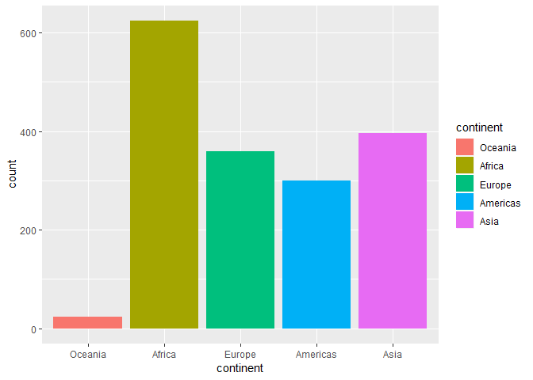

Homework 05 - Factor and figure management
================

## Load packages

``` r
library(gapminder)
library(tidyverse)
library(knitr)
```

## Part 1: Factor Management

I will use the gapminder dataset for this exercise.

### Drop level/factors

The original gapminder data looks like:

``` r
head(gapminder)
```

    ## # A tibble: 6 x 6
    ##   country     continent  year lifeExp      pop gdpPercap
    ##   <fct>       <fct>     <int>   <dbl>    <int>     <dbl>
    ## 1 Afghanistan Asia       1952    28.8  8425333      779.
    ## 2 Afghanistan Asia       1957    30.3  9240934      821.
    ## 3 Afghanistan Asia       1962    32.0 10267083      853.
    ## 4 Afghanistan Asia       1967    34.0 11537966      836.
    ## 5 Afghanistan Asia       1972    36.1 13079460      740.
    ## 6 Afghanistan Asia       1977    38.4 14880372      786.

``` r
str(gapminder)
```

    ## Classes 'tbl_df', 'tbl' and 'data.frame':    1704 obs. of  6 variables:
    ##  $ country  : Factor w/ 142 levels "Afghanistan",..: 1 1 1 1 1 1 1 1 1 1 ...
    ##  $ continent: Factor w/ 5 levels "Africa","Americas",..: 3 3 3 3 3 3 3 3 3 3 ...
    ##  $ year     : int  1952 1957 1962 1967 1972 1977 1982 1987 1992 1997 ...
    ##  $ lifeExp  : num  28.8 30.3 32 34 36.1 ...
    ##  $ pop      : int  8425333 9240934 10267083 11537966 13079460 14880372 12881816 13867957 16317921 22227415 ...
    ##  $ gdpPercap: num  779 821 853 836 740 ...

We see that there are 5 levels of continent.

``` r
levels(gapminder$continent)
```

    ## [1] "Africa"   "Americas" "Asia"     "Europe"   "Oceania"

Let’s see what happens when we remove all observations where the
continent is Oceania. We can remove all occurances of Oceania under
continents using `filter` and observe how this affects the dataframe:

``` r
gapminder_no_ocean = gapminder %>% 
  filter(continent != 'Oceania')

gapminder_no_ocean %>% str()
```

    ## Classes 'tbl_df', 'tbl' and 'data.frame':    1680 obs. of  6 variables:
    ##  $ country  : Factor w/ 142 levels "Afghanistan",..: 1 1 1 1 1 1 1 1 1 1 ...
    ##  $ continent: Factor w/ 5 levels "Africa","Americas",..: 3 3 3 3 3 3 3 3 3 3 ...
    ##  $ year     : int  1952 1957 1962 1967 1972 1977 1982 1987 1992 1997 ...
    ##  $ lifeExp  : num  28.8 30.3 32 34 36.1 ...
    ##  $ pop      : int  8425333 9240934 10267083 11537966 13079460 14880372 12881816 13867957 16317921 22227415 ...
    ##  $ gdpPercap: num  779 821 853 836 740 ...

``` r
levels(gapminder_no_ocean$continent)
```

    ## [1] "Africa"   "Americas" "Asia"     "Europe"   "Oceania"

We see that despite there are now fewer observations in the dataframe,
however the factor levels of continent is still 5. Despite removing the
occurances of Oceania, it is still a level in the factor. We can remove
this level altogether with `droplevels()`

``` r
gapminder_no_ocean = gapminder_no_ocean %>% 
  droplevels()

gapminder_no_ocean %>% str()
```

    ## Classes 'tbl_df', 'tbl' and 'data.frame':    1680 obs. of  6 variables:
    ##  $ country  : Factor w/ 140 levels "Afghanistan",..: 1 1 1 1 1 1 1 1 1 1 ...
    ##  $ continent: Factor w/ 4 levels "Africa","Americas",..: 3 3 3 3 3 3 3 3 3 3 ...
    ##  $ year     : int  1952 1957 1962 1967 1972 1977 1982 1987 1992 1997 ...
    ##  $ lifeExp  : num  28.8 30.3 32 34 36.1 ...
    ##  $ pop      : int  8425333 9240934 10267083 11537966 13079460 14880372 12881816 13867957 16317921 22227415 ...
    ##  $ gdpPercap: num  779 821 853 836 740 ...

``` r
levels(gapminder_no_ocean$continent)
```

    ## [1] "Africa"   "Americas" "Asia"     "Europe"

Now that we applied `droplevels()` to this dataset, we see that the
continent has 4 levels, and Oceania is no longer a level of continent.

### Reorder levels

By default, R will order the levels alphabetically. We can see this if
we do a basic bar plot of number of observations:

``` r
gapminder %>% 
  ggplot(aes(continent))+
  geom_bar(aes(fill=continent))
```

<!-- -->

However, we would find it more helpful if the ordering has actual
meaning. To do this, we can use `mutate` and `fct_reorder`

``` r
gapminder %>% 
  mutate(continent=fct_reorder(continent,pop)) %>% 
  ggplot(aes(continent))+
  geom_bar(aes(fill=continent))
```

<!-- -->

Here, we ordered the rows by the populations. Since there are multiple
values for population for each continent, `R` arranged the bars based on
the median. we could also specify functions other than `median`:

``` r
gapminder %>% 
  mutate(continent=fct_reorder(continent,pop, .fun = function(x) sum(x)^2/length(x))) %>% 
  ggplot(aes(continent))+
  geom_bar(aes(fill=continent))
```

<!-- -->

We can do this for more than bar plots. Let’s examine GDP data for Asia
in 2007:

``` r
gapminder_asia = gapminder %>% 
  filter(continent == 'Asia')
gapminder_asia %>% 
  ggplot(aes(gdpPercap,country))+
  scale_x_log10() +
  geom_point(aes(color=year))
```

<!-- -->

This is the default ordering done by `R`. Once again we would like this
to be ordered:

``` r
gapminder_asia %>% 
  mutate(country=fct_reorder(country,gdpPercap)) %>% 
  ggplot(aes(gdpPercap,country)) +
  scale_x_log10() +
  geom_point(aes(color=year))
```

<!-- -->

Like the bar plot before, `R` uses the default function of `median` for
the sorting. We can also specify a different function:

``` r
gapminder_asia %>% 
  mutate(country=fct_reorder(country,gdpPercap,.fun=function(x) max(x)-min(x))) %>% 
  ggplot(aes(gdpPercap,country)) +
  scale_x_log10() +
  geom_point(aes(color=year))
```

<!-- -->

We see that with a different function, the ordering is slightly
different. Here we made our own function that gives the spread of the
GDP. Note that the range of the points along each row doesn’t quite look
like they are getting bigger the higher up we go, but this is because
the x-axis is on a log scale.

## Part 2: File I/O

We will take our `gapminder_asia` dataframe, add a few columns. We will
also change the years to a factor and the population to a string. , We
will save the resulting dataframe to a `.csv` file:

``` r
gapminder_to_export = gapminder_asia %>% 
  mutate(pop_indicator = ifelse(pop>mean(pop),'high','low'),
         lifeExp_indicator = ifelse(lifeExp>mean(pop),'high','low'),
         pop = as.character(pop),
         year = as.factor(year))
gapminder_to_export %>% 
  write_csv('gapminder_asia.csv')
str(gapminder_to_export)
```

    ## Classes 'tbl_df', 'tbl' and 'data.frame':    396 obs. of  8 variables:
    ##  $ country          : Factor w/ 142 levels "Afghanistan",..: 1 1 1 1 1 1 1 1 1 1 ...
    ##  $ continent        : Factor w/ 5 levels "Africa","Americas",..: 3 3 3 3 3 3 3 3 3 3 ...
    ##  $ year             : Factor w/ 12 levels "1952","1957",..: 1 2 3 4 5 6 7 8 9 10 ...
    ##  $ lifeExp          : num  28.8 30.3 32 34 36.1 ...
    ##  $ pop              : chr  "8425333" "9240934" "10267083" "11537966" ...
    ##  $ gdpPercap        : num  779 821 853 836 740 ...
    ##  $ pop_indicator    : chr  "low" "low" "low" "low" ...
    ##  $ lifeExp_indicator: chr  "low" "low" "low" "low" ...

The csv file is saved
[here](https://github.com/STAT545-UBC-students/hw05-451error/blob/master/gapminder_asia.csv).
We can now read back the csv file to see how many of the changes we made
survived writing to file:

``` r
gapminder_csv_import = read_csv('gapminder_asia.csv')
```

    ## Parsed with column specification:
    ## cols(
    ##   country = col_character(),
    ##   continent = col_character(),
    ##   year = col_integer(),
    ##   lifeExp = col_double(),
    ##   pop = col_integer(),
    ##   gdpPercap = col_double(),
    ##   pop_indicator = col_character(),
    ##   lifeExp_indicator = col_character()
    ## )

``` r
gapminder_csv_import %>% str()
```

    ## Classes 'tbl_df', 'tbl' and 'data.frame':    396 obs. of  8 variables:
    ##  $ country          : chr  "Afghanistan" "Afghanistan" "Afghanistan" "Afghanistan" ...
    ##  $ continent        : chr  "Asia" "Asia" "Asia" "Asia" ...
    ##  $ year             : int  1952 1957 1962 1967 1972 1977 1982 1987 1992 1997 ...
    ##  $ lifeExp          : num  28.8 30.3 32 34 36.1 ...
    ##  $ pop              : int  8425333 9240934 10267083 11537966 13079460 14880372 12881816 13867957 16317921 22227415 ...
    ##  $ gdpPercap        : num  779 821 853 836 740 ...
    ##  $ pop_indicator    : chr  "low" "low" "low" "low" ...
    ##  $ lifeExp_indicator: chr  "low" "low" "low" "low" ...
    ##  - attr(*, "spec")=List of 2
    ##   ..$ cols   :List of 8
    ##   .. ..$ country          : list()
    ##   .. .. ..- attr(*, "class")= chr  "collector_character" "collector"
    ##   .. ..$ continent        : list()
    ##   .. .. ..- attr(*, "class")= chr  "collector_character" "collector"
    ##   .. ..$ year             : list()
    ##   .. .. ..- attr(*, "class")= chr  "collector_integer" "collector"
    ##   .. ..$ lifeExp          : list()
    ##   .. .. ..- attr(*, "class")= chr  "collector_double" "collector"
    ##   .. ..$ pop              : list()
    ##   .. .. ..- attr(*, "class")= chr  "collector_integer" "collector"
    ##   .. ..$ gdpPercap        : list()
    ##   .. .. ..- attr(*, "class")= chr  "collector_double" "collector"
    ##   .. ..$ pop_indicator    : list()
    ##   .. .. ..- attr(*, "class")= chr  "collector_character" "collector"
    ##   .. ..$ lifeExp_indicator: list()
    ##   .. .. ..- attr(*, "class")= chr  "collector_character" "collector"
    ##   ..$ default: list()
    ##   .. ..- attr(*, "class")= chr  "collector_guess" "collector"
    ##   ..- attr(*, "class")= chr "col_spec"

We see that based on the default options loaded texts as `characters`
and anything that looks like a number as a `num` or `int`. In order to
have `R` load the csv file the way we want, we could use the function
`read.csv()` instead and use the option `colClasses` to specify the
format that we want each column to be read:

``` r
gapminder_csv_import = read.csv('gapminder_asia.csv',
                                colClasses = c(rep('factor',3),
                                               rep('numeric',3),
                                               rep('factor',2)))
gapminder_csv_import %>% str()
```

    ## 'data.frame':    396 obs. of  8 variables:
    ##  $ country          : Factor w/ 33 levels "Afghanistan",..: 1 1 1 1 1 1 1 1 1 1 ...
    ##  $ continent        : Factor w/ 1 level "Asia": 1 1 1 1 1 1 1 1 1 1 ...
    ##  $ year             : Factor w/ 12 levels "1952","1957",..: 1 2 3 4 5 6 7 8 9 10 ...
    ##  $ lifeExp          : num  28.8 30.3 32 34 36.1 ...
    ##  $ pop              : num  8425333 9240934 10267083 11537966 13079460 ...
    ##  $ gdpPercap        : num  779 821 853 836 740 ...
    ##  $ pop_indicator    : Factor w/ 2 levels "high","low": 2 2 2 2 2 2 2 2 2 2 ...
    ##  $ lifeExp_indicator: Factor w/ 1 level "low": 1 1 1 1 1 1 1 1 1 1 ...

## Part 3: Visualization design

I will try to improve upon the graph used in the previous part, namely
the Asian countries GDP plot, recreated here:

``` r
gapminder_asia %>% 
  mutate(country=fct_reorder(country,gdpPercap,.fun=function(x) max(x)-min(x))) %>% 
  ggplot(aes(gdpPercap,country)) +
  scale_x_log10() +
  geom_point(aes(color=year))
```

<!-- -->

We see that the scientific numbering of the x-axis is not very
user-friendly and the different colours for the years is not too
helpful. We also re-name the axis and change the theme so the background
isn’t grey..

``` r
library(scales)
```

    ## 
    ## Attaching package: 'scales'

    ## The following object is masked from 'package:purrr':
    ## 
    ##     discard

    ## The following object is masked from 'package:readr':
    ## 
    ##     col_factor

``` r
gdp_asia_plot = gapminder_asia %>% 
  mutate(country=fct_reorder(country,gdpPercap,.fun=function(x) max(x)-min(x))) %>% 
  ggplot(aes(gdpPercap,country)) +
  scale_x_log10(labels=dollar_format()) +
  geom_point(aes(color=country)) +
  labs(x='GDP per capita',
       y = 'Country')+
  scale_color_discrete(guide=F)+
  theme_light()
gdp_asia_plot
```

<!-- -->

Now it might not make sense to change all the years to have the same
colour since we can’t tell them apart, but I plan on using `gganimate`
to animate the plot so that the plot will changes in the GDP by year,
and this will not be an issue any more. I first install `gganimate` as
below. `install.packages('gganimate')` is not supported as it is not yet
available on CRAN.

``` r
# install.packages('devtools')
# devtools::install_github('thomasp85/gganimate')
library(gganimate)
```

The animated plot is below:

``` r
gdp_asia_plot+
  labs(title = 'Year: {frame_time}', x = 'GDP per capita', y = 'Country') +
  transition_time(year) +
  ease_aes('linear')
```

<!-- -->

We can also convert the above plot using `ggplotly` function in the
`plotly` package.

``` r
library(plotly)
```

    ## 
    ## Attaching package: 'plotly'

    ## The following object is masked from 'package:ggplot2':
    ## 
    ##     last_plot

    ## The following object is masked from 'package:stats':
    ## 
    ##     filter

    ## The following object is masked from 'package:graphics':
    ## 
    ##     layout

``` r
ggplotly(gdp_asia_plot) %>% 
  htmlwidgets::saveWidget(file = "ggplotly_gdp_asia.html")
```

We can’t display `plotly` plots here, but the so the `R` code would need
to be run in order to interact with this plot. The HTML output has been
saved
[here](https://github.com/STAT545-UBC-students/hw05-451error/blob/master/ggplotly_gdp_asia.html)

## Part 4: Writing figures to file

I can save `gdp_asia_plot` from the previous part using the `ggsave`
command:

``` r
ggsave('gdp_asia.png',width = 6,height=6,gdp_asia_plot)
```

The saved image can be found
[here](https://github.com/STAT545-UBC-students/hw05-451error/blob/master/gdp_asia.png),
and here it is:


We can also save it in a vector format thus:

``` r
ggsave('gdp_asia.svg',width = 6,height=6, gdp_asia_plot)
```

And the saved image can be found
[here](https://github.com/STAT545-UBC-students/hw05-451error/blob/master/gdp_asia.svg).
